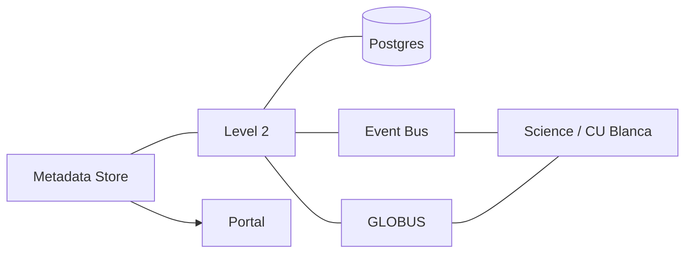
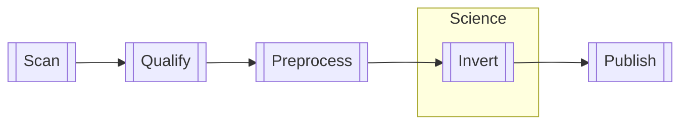

Level 2 Inversion
=================

See [DEVELOPMENT.md](./DEVELOPMENT.md)

Unknowns
--------

- [ ] Reading the Metadata store and also having the Metadata Store read from us feels strange. Circular dependency. But updating whatever service is behind Metadata is 
- [ ] (Tony) We need local persistence to know the state of what worked has already been performed, but a new DB may increase the workload for Tony. Using an existing database creates an unwanted dependency. 
- [ ] Who chooses which OP to process next? Do we manually choose one and notify them, or can they work on any ready OP?
- [ ] Han wants to work on OPs, not datasets. How do we know when an OP is complete? Are all datasets activated at once?

Service Graph
-------------

Process
-------

_Scan_ - Check the entire metadata store for OP candidates and add to the database if they don't exist. Update if necessary

_Qualify_ - Check criteria for invertibility and record if OPs are invertible or not

_Preprocess_ - Preprocess data if necessary, saving intermediate files as needed

_Invert_ - Han's Science Team manually inverts the OP

_Publish_ - Make L2 data available to metadata store / portal

Inversion States
----------------

Observing Programs are identified, then pass through the following states.

States are cumulative, meaning an OP at the `Inverted` state, would have the states:

    Discovered
    Invertible
    Preprocessed
    Queued
    Inverted

 And an OP that errored during preprocessing would have the states:

    Discovered
    Invertible
    Error "Preprocessing ____"
