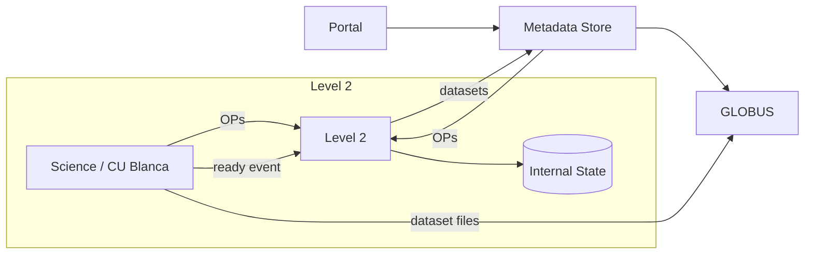
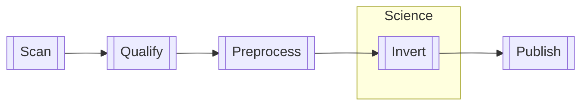
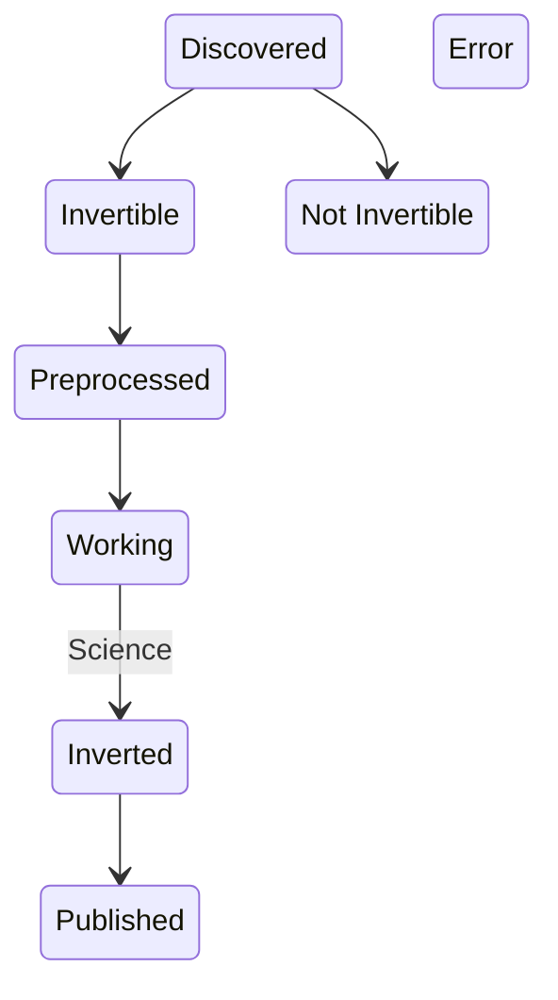

Level 2 Inversion
=================

See [DEVELOPMENT.md](./DEVELOPMENT.md)

Accepting Thunderbolts Certificate
------------------------------

Questions
--------

- [ ] Who chooses which OP to process next?
  * do we mark A as "work on this  next?"
  * or does Han scan available work and choose?
  * who gets yelled at if something doesn't get done?

Answers
--------
- [x] (Tony) We need local persistence but a new DB may increase the workload for Tony.
  - Build against POSTGRES. Tony will figure it out
  - migrations can work any way
- [x] Han wants to work on OPs, not datasets. How do we know when an OP is complete?
  - OPs do not exist at the metadata level yet
  - Wait a certain number of days for all datasets to appear before assuming it is ready.
- [x] How does L2 data become available to the system?
  - L2 will store OP metadata related to inversions
  - Metadata store will aggregate this information and introduce an OP schema

Service Graph
-------------

Arrow indicate the direction of dependency. If A -> B, then A is aware of B and calls it or interacts with it.

Deployable Containers
* L2 Service
* State Postgres DB - New or existing instance, but L2 accesses unique tables

Process
-------

_Scan_ - Check the entire metadata store for OP candidates and add to the database if they don't exist. Update if necessary

[_Qualify_](docs/Invertibility.md) - Check criteria for invertibility and record if OPs are invertible or not

_Preprocess_ - Preprocess data if necessary, saving intermediate files if needed (unknown)

_Invert_ - Han's Science Team manually inverts the OP

_Publish_ - Make L2 data available to metadata store / portal

Inversion States
----------------

Observing Programs are identified, then pass through the following states. The graph below illustrates a successful flow, but any processing step may fail, putting the OP into an Error state. 

We record this history of all states, and only add information rather than mutating the record

Definitions
-----------

**Observing Program** - a group of datasets related to a single observation with a measurement in mind, which is a smaller division of a proposal
