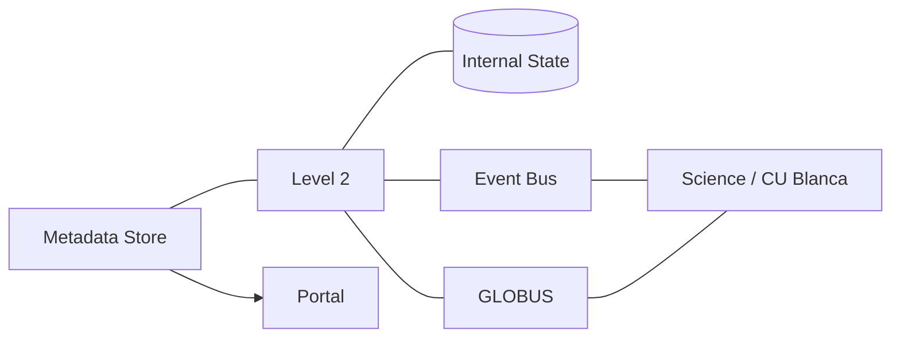

Level 2 Inversion
=================

See [DEVELOPMENT.md](./DEVELOPMENT.md)

Questions
--------

- [ ] L2 data and metadata should be available from the existing metadata store, portal, etc. Do we publish data to the metadata store? To search support directly?  does metadata store read from us? or is there a downstream 3rd service which unifies metadata and other sources?
  - Avoid data interdependencies.
  - Need to redraw L1 service boundaries?
- [ ] (Tony) We need local persistence to know the state of what worked has already been performed, but a new DB may increase the workload for Tony. Using an existing database creates an unwanted dependency. 
  - use existing postgres instance for search support with new tables?
- [ ] Who chooses which OP to process next? Do we manually choose one and notify Han, or do they choose from a list we provide?

Answers
--------
- [x] Han wants to work on OPs, not datasets. How do we know when an OP is complete?
  - There is no reliable metadata for this: OPs do not exist at the metadata level yet. It was suggested that we wait a certain number of days for all datasets to appear before assuming it is ready.

Service Graph
-------------

Process
-------

_Scan_ - Check the entire metadata store for OP candidates and add to the database if they don't exist. Update if necessary

_Qualify_ - Check criteria for invertibility and record if OPs are invertible or not

_Preprocess_ - Preprocess data if necessary, saving intermediate files as needed

_Invert_ - Han's Science Team manually inverts the OP

_Publish_ - Make L2 data available to metadata store / portal

Inversion States
----------------

Observing Programs are identified, then pass through the following states. Any processing step may fail, putting the OP into an Error state. The graph below illustrates a successful flow

States are cumulative, meaning an OP at the `Inverted` state, would have the states:

    Discovered
    Invertible
    Preprocessed
    Queued
    Inverted

 And an OP that errored during preprocessing would have the states:

    Discovered
    Invertible
    Error "Preprocessing ____"

Definitions
-----------

**Observing Program** - a group of datasets related to a single observation with a measurement in mind, which is a smaller division of a proposal. These may be data from different ViSP arms?
